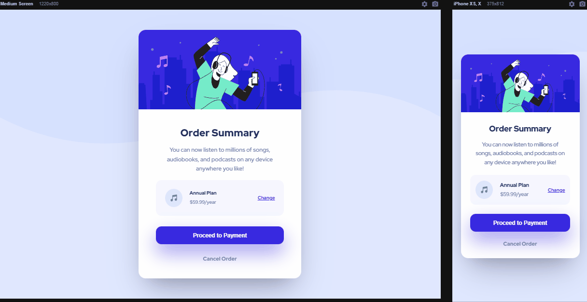

# Order Sumary Component Main

Esse projeto é um desafio encontrado na página do [Frontend Mentor](https://www.frontendmentor.io/challenges/order-summary-component-QlPmajDUj) que consiste em replicar este cartão de anúncio proposto utilizando as linguagens de *HTML* e *CSS*. Todas as orientações e ferramentas, como o tipo de fonte, as cores e as imagens, são fornecidas, bastando que o desenvolvedor ponha em prática seus conhecimentos das duas linguagens necessárias e construa o cartão o mais parecido possível com o design proposto.

## Linguagens usadas
- HTML
- CSS

## Desafios e dificuldades

Este projeto não apresentou um grande desafio, então busquei deixar o máximo parecido possível com o cartão do design. Algumas extensões do Chrome foram ótimos recursos para averiguar a semelhança.